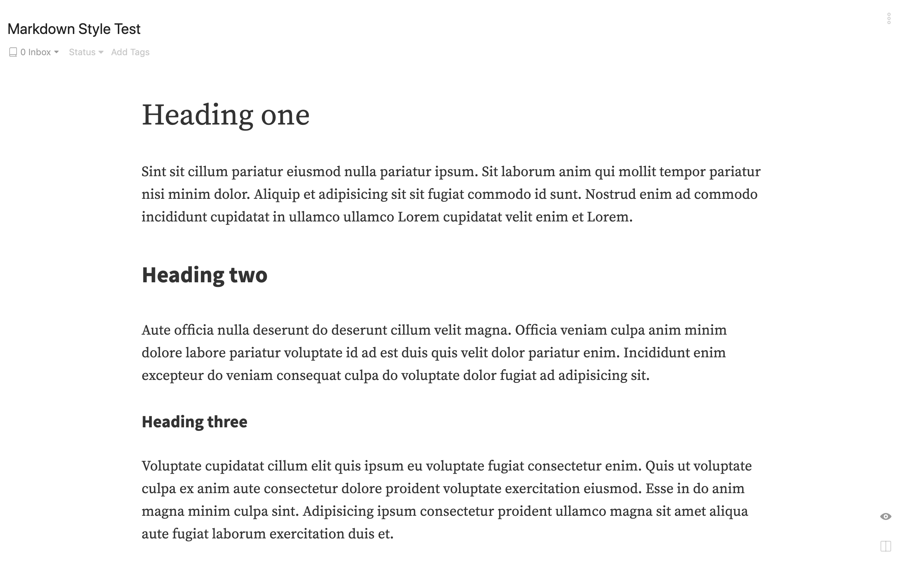

# Source Baseline Preview Theme

Markdown preview theme for [Inkdrop](https://www.inkdrop.info/).

 * `styles/github-markdown.less` - Styles for light UI theme
 * `styles/github-markdown-dark.less` - Styles for dark UI theme

 

## Change Log

- 2021/05/31 Change body font for Han languages to Source Han Serif to better match the English setting. If you'd like to keep using sans font, I made [another plugin](https://my.inkdrop.app/plugins/style-override) so you can easily override it. 

## Typography

- Recommend to set preview font at 20pt
- Using Source font to work across many languages
- For Simplified and Traditional Chinese, Japanese, and Korean characters, install Source Hans fonts
	- https://github.com/adobe-fonts/source-han-serif
	- https://github.com/adobe-fonts/source-han-sans
	- https://github.com/adobe-fonts/source-han-mono
- If you'd like to use other fonts, download my [other plugin](https://my.inkdrop.app/plugins/style-override) to override them.

## Baseline Alignment

Loosely implemented https://github.com/tyssen/Less-Baseline-Grid-Generator with the following changes:

- Table rows take 1.5 line
- Image could break baseline alignments (because it's not worth it to force markdown images to follow a grid)

## Theming code blocks

Highlighting code blocks is built with [CodeMirror](https://codemirror.net/demo/theme.html), and CSS selectors for styling code blocks are compatible with it.
CSS selectors always start with `cm-`.
You can easily import styles from [CodeMirror's theme](https://github.com/codemirror/CodeMirror/tree/master/theme).
